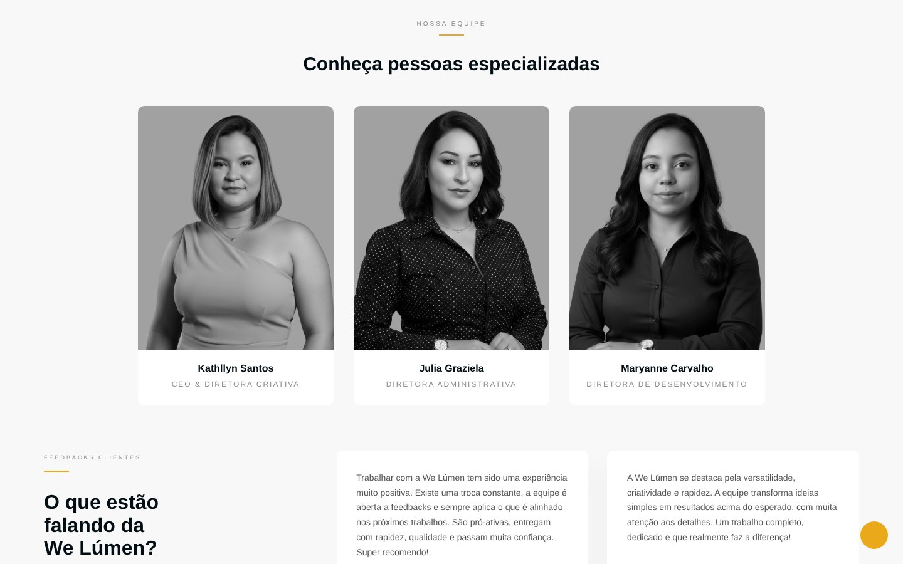

# We Lúmen

Site institucional e página de link na bio da **We Lúmen**, empresa de transformação digital que atua com sites e e-commerces, identidade visual, redes sociais e conteúdo, edição de vídeo e motion, e diagramação de álbuns.

- Site: https://welumen.com.br
- Link da bio: https://welumen.com.br/bio.html
- Instagram: [@welumenoficial](https://www.instagram.com/welumenoficial/)
- E-mail: welumenoficial@gmail.com

## Prévia


| Projetos | Equipe | Celular |
|:---:|:---:|:---:|
|  |  |  |

---

## Sobre o projeto

Site estático feito com **HTML, CSS e JavaScript puro**, sem frameworks e sem etapa de build. Basta abrir o `index.html` no navegador.

### Seções do site

| Seção | O que mostra |
|---|---|
| Home | Hero com carrossel e chamada para o WhatsApp |
| Serviços | Os 5 serviços da We Lúmen |
| Sobre | Apresentação da empresa |
| Como trabalhamos | As 4 etapas do processo, do briefing à entrega |
| Projetos | Vitrine de trabalhos com filtro por serviço |
| Números | Barra com os dados da empresa |
| Equipe | Diretoras da We Lúmen |
| Depoimentos | Carrossel de clientes, com link para o Instagram de cada uma |
| Contato | Botão de WhatsApp e e-mail |

Também fazem parte do projeto:

- `bio.html`: página de link na bio, com os serviços e os formulários de pedido de orçamento.
- `privacidade.html`: Política de Privacidade (LGPD).

### Serviços

| Nome | O que é |
|---|---|
| Web Lúmen | Sites e e-commerce |
| Identity Lúmen | Logotipos e identidade visual |
| Social Lúmen | Gestão de redes sociais e criação de conteúdo |
| Motion Lúmen | Edição de vídeo e motion design |
| Álbum Lúmen | Diagramação de álbuns fotográficos |

---

## Estrutura de pastas

```
.
├── index.html            Página principal
├── bio.html              Link da bio (CSS próprio dentro do arquivo)
├── privacidade.html      Política de Privacidade
├── README.md
├── docs/                 Prints usados neste README
└── src/
    ├── css/
    │   ├── style.css     Estilos principais
    │   └── extras.css    Ajustes, seção "Como trabalhamos", depoimentos, rodapé
    ├── js/
    │   ├── script.js     Carrossel do hero, menu mobile, filtro de projetos, depoimentos
    │   └── extras.js     Acessibilidade por teclado nos pontos do carrossel
    └── img/              Logos, ícones, fotos da equipe e dos projetos
```

> O `extras.css` deve ser carregado **depois** do `style.css`, porque usa as variáveis dele.

---

## Como rodar localmente

Não precisa instalar nada.

1. Baixe ou clone o repositório.
2. Abra o `index.html` no navegador.

Opcionalmente, com um servidor local (útil para testar os caminhos das imagens):

```bash
# na pasta do projeto
python3 -m http.server 8000
# abra http://localhost:8000
```

---

## Como editar

### Adicionar um projeto ao portfólio

Em `index.html`, na seção `#projetos`, copie um bloco `.portfolio-item` e troque:

1. a imagem (`src/img/...`);
2. o `data-category`: `web`, `identity`, `social`, `motion` ou `album`;
3. o serviço dentro do `<span>`;
4. o nome do cliente no `<h3>`.

Para o projeto abrir um link (Instagram, site do cliente), troque o `<div class="portfolio-item">` por `<a href="..." target="_blank" rel="noopener noreferrer">`.

### Adicionar um depoimento

Copie um bloco `.testimonial-card` em `#depoimentos`, troque o texto, a foto, o nome e o @ do Instagram do cliente. Só publique depoimentos reais e com autorização.

### Contato

- WhatsApp: `https://wa.me/5511968106788` (aparece no botão da seção de contato e no rodapé).
- E-mail: `welumenoficial@gmail.com` (seção de contato, rodapé e dados estruturados no `<head>`).

### Cores e fontes

As cores ficam como variáveis no início do `src/css/style.css`:

| Variável | Uso |
|---|---|
| `--dark` `#020e14` | fundo escuro |
| `--gold` `#e9a91b` | destaque dourado |
| `--gray` `#8d8c8c` | textos secundários |
| `--light` `#f8f8f8` | fundo claro |

Fonte: **Montserrat** (Google Fonts). Ícones: **Font Awesome 6**.

---

## Publicação

O site é estático: basta enviar os arquivos para o servidor ou para o GitHub Pages, mantendo a estrutura de pastas.

Depois de publicar uma mudança, abra o site com **Ctrl+F5** para limpar o cache do navegador.

---

## Pendências

- [ ] Cadastrar todos os projetos reais no portfólio
- [ ] Incluir o CNPJ no rodapé quando a empresa tiver
- [ ] Trocar imagens de exemplo pelas fotos reais da equipe e dos projetos
- [ ] Revisar a Política de Privacidade com um profissional jurídico

---

© 2026 We Lúmen. Todos os direitos reservados.
